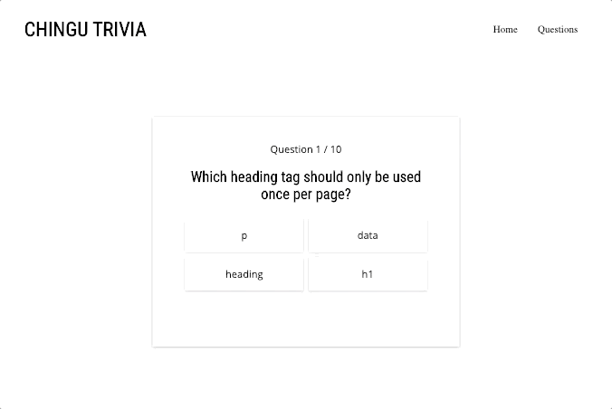

# Chingu Solo Project - Tier 1 - Chingu Trivia

## Overview 

This project is a great opportunity to develop a clean and modern webpage. The trivia app will be completed across tiers, with each tier adding a new level of complexity. You are currently on the **Tier 1 repo**. You'll be responsible for coding the **HTML**, **CSS**, and **JavaScript** to get the structure, styling, and some basic functionality up and running.

As you add skills to your developer toolbag you'll be able to come back to this project and add in the Tiers 2 and 3 features. Ultimately you'll have a great portfolio piece, and will have implemented a number of common and in-demand features.

**You May NOT Use Libraries and/or Frameworks for Tiers 1**

## About Chingu

If you aren’t yet a member of Chingu we invite you to join us. We help our 
members transform what they’ve learned in courses & tutorials into the 
practical experience employers need and want.

Our remote team projects let you refine your technical skills and put them 
into practice while gaining new “soft” skills like communication, 
collaboration, and Agile project management. The types of skills that 
help real-world teams get things done!

You can learn more and join us at [chingu.io](https://chingu.io).

## Instructions

General instructions for all Pre-Work Projects can also be found in the Chingu Voyage Handbook (URL posted in the `#read-me-first` channel on Discord).

#### Requirements

*Structure*

- [ ] Header item that includes the name for the app, and tabs (if using)
- [ ] Card that displays a trivia question and four multiple choice answers
- [ ] Place element that displays which question number the user is on and the total number of questions (ex. 'Question 1 / 10')
- [ ] Display buttons for advancing to the next question once the current question has been answered
- [ ] Display a message to the user that informs them if their answer was right or wrong
- [ ] Display a clear message to the user when the trivia session is done, and include the user's score

*Styling:*

- [ ] Styles should be reminiscent of the demo versions. Feel free to use artistic licencse as long as the functionality doesn't suffer 

*Functionality*

- [ ] The quiz should span at least 10 questions. Feel free to add more if you would like.
- [ ] The page should not reload! Hardcode all of your questions/choices in your JS file and use DOM manipulation to insert text as you go
- [ ] An array of questions/choices can be found in the `assets` folder of this repo *(filename is 'quizQuestions.js')*; feel free to copy/paste the array in your JS file

*Upon Load:*

- [ ] Load the first question and display the user's place as *Question 1 / 10*
- [ ] Make sure the button used to advance questions is either not visible or not clickable until an answer is submitted

*Considerations:*

- [ ] Try and style your app so that it doesn't overflow the viewport (require scrolling) on any device
- [ ] Make sure your User Experience design is intuitive (buttons are clearly disabled when not available, messages are clear, etc)
- [ ] In the name of responsiveness: please try and have your answer buttons (or divs, or whatever you use) collapse into a column in small sizes (iPhone5, etc)

*Other:*

- [ ] Your repo needs to have a robust README.md
- [ ] Make sure that there are no errors in the developer console before submitting

**Extras (Not Required)**

- [ ] Make your design fully responsive *(small/large/portrait/landscape, etc.)*
- [ ] Offer the user the ability to navigate to previous questions
- [ ] Play with formats for user interaction: drag 'n drop vs. click, etc.

## Example

